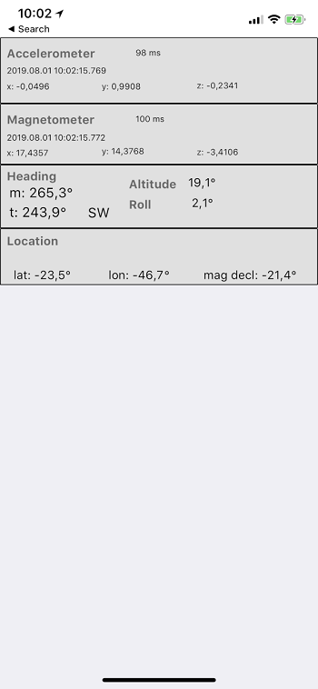

# FiremonkeySensorFusion
Accelerometer+Magnetometer+GPS sensor association object. The object calculates rectangular coordinates.
This can be used to power augmented reality apps for mobile devices. 

Cross platform code ( Android and iOS ). Tested w/ Delphi 10.3.3

This project uses DelphiWorlds Android sensor code (KastriFree lib)  by Dave Nottage ( files with DW. prefix )

This component is currently used in app "CamSextant"  

Works as follows:
1. Get GPS position, to calculate Magnetic Declination. Android offers a WMM service for that. iOS seems to have it too, but I worked the magnetic declination from TrueHeading/MagHeading properties of the GPS device. 
2. Get Accelerometer and Magnetometer 3D vectors
3. Calculate tilt compensated rectangular coordinates* by rotating the magnetometer vector with the accelerometer vector. This results in the magnetic vector in relation to the phone attitude.
4. Apply magnetic declination to obtain True Heading (azimuth)

* ( many names for rectangular coordinates: azimuth/altitude/roll or heading/elevation/roll or pitch/bank/roll )

iOS version uses a 100ms timer to get sensor readings. It would be better to use sensor change events, but I don't know how to do that.

Android version uses native sensor code ( DelphiWorlds )

Note that iOS GPS sensor has a TrueHeading property, which could be used directly, avoiding all this. But it has a problem when the altitude crosses the 45 degree boundary. The GPS TrueHeading jumps several degrees at that point. My guess is that iOS changes the rectangular coordinates axis when the altitude is more than 45 degrees, which I think is wrong. Not sure.

note: versions before D10.3.3 used a hack to pass int64 via JNI on Android (Delphi JNI had some endian problem  ).
This was commented when the compiler was corrected. Watch if using previous Delphi versions ( i.e. uncomment the hack )

## Usage samples

* SensorFusionDemo1 - SImple sample in this repository.
* BoatAttitude - A more elaborate sample can be found at https://github.com/omarreis/BoatAttitude . The app illustrates how to use quaternions to set object rotations, instead of manipulating RotationAngle
.
## SensorFusionDemo screenshot.

